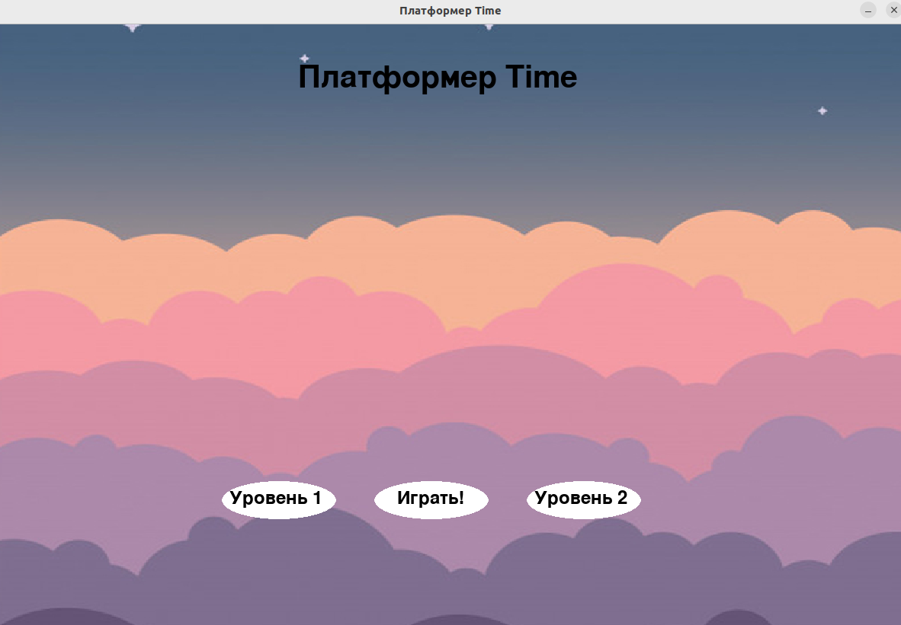
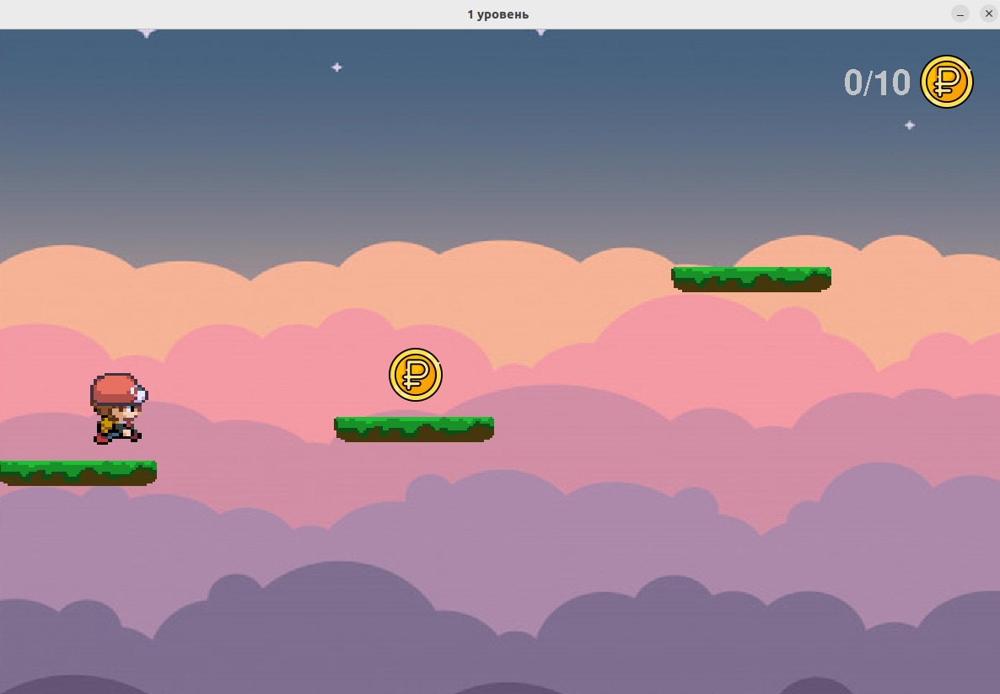
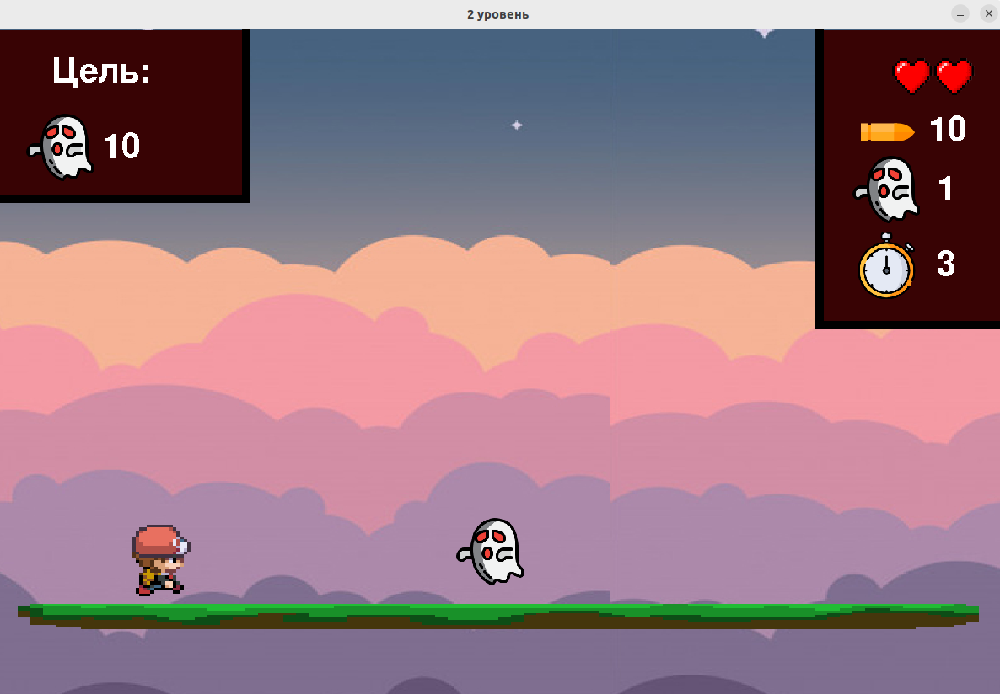

# Платформер Time

***Авторы проекта***: *Гладких Александр*

***Идея проекта***: *Time — платформер написанный на pygame. В нем будет несколько уровней, враги, а также интересная игровая механика.*

***Описание реализации***: *От классов я отрёкся сразу, т.к. они показались мне неудобными в столь небольшём проекте. Было написано меню для выбора уровней, которое скомпилировано в  .exe (main.exe), а также файлы двух уровней - level1.py, level2.py.*

***Описание технологий***: *В проекте используется только pygame и pillow. Для запуска проекта необходимо клонировать репозиторий, ветку sasha_gladkih или master. После успешного клонирования, необходимо все файлы репозитория вынести из него, в главную папку проекта PyCharm, а после запустить main.exe*

```
pip install pygame pillow
```

```
1) git clone https://github.com/gladkihaa-28/Time-platformer.git

2) git clone https://github.com/gladkihaa-28/Time-platformer.git -b sasha_gladkih
```

```
./main.exe
```

## Снимки:








